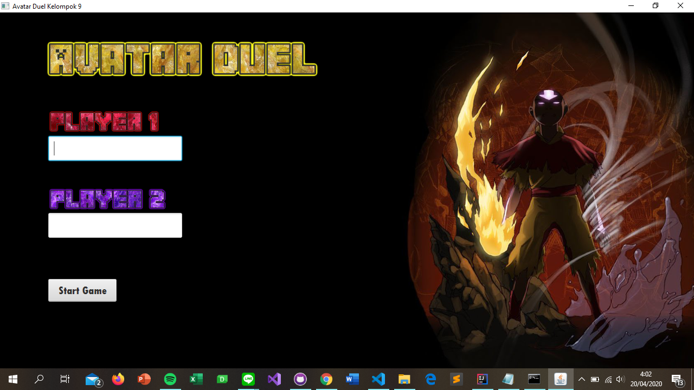
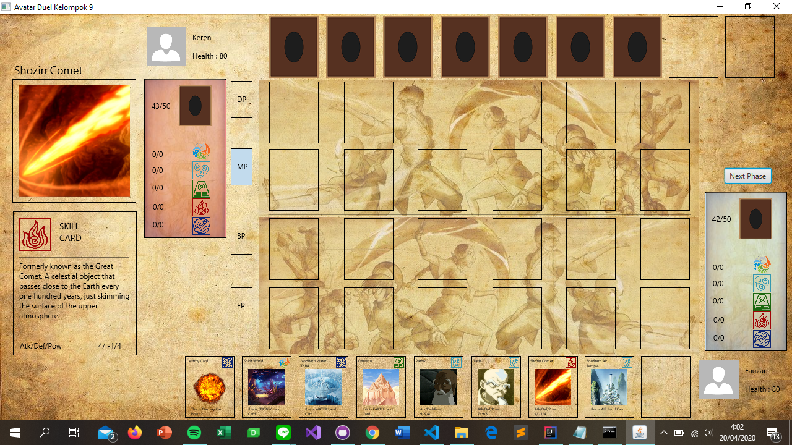

# IF2210 Project Kelompok 9 K01

## Prerequisite
Java 8
JavaFx

## How to Compile and Run Program
1. Open terminal in this folder
2. Try running these commands to compile and run the program `/gradlew run`

## Build Documentation
1. Open terminal in this folder
2. Try running these commands to compile and run the program `/gradlew avatarDocs`
3. you can see the documentation in ./build/docs/javadoc/index.html

## SceenShots

## Credit
All images and description are taken from [Avatar Wikia](https://avatar.fandom.com/wiki/Avatar_Wiki)
